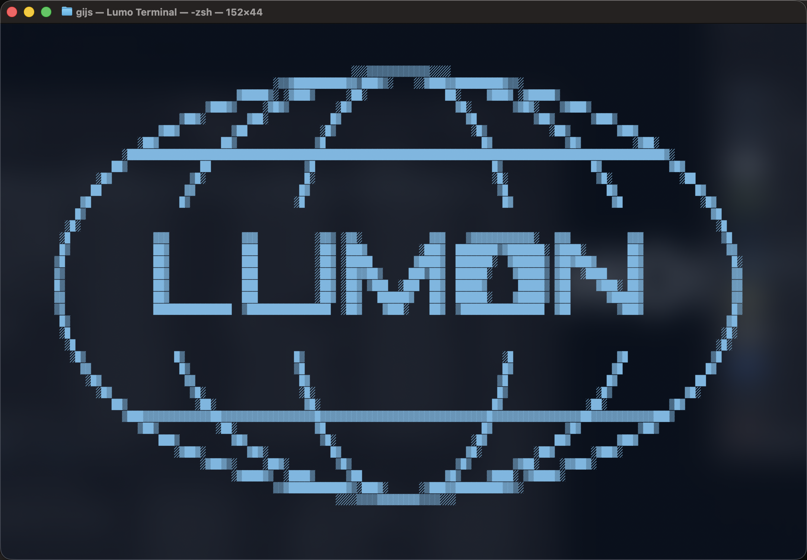
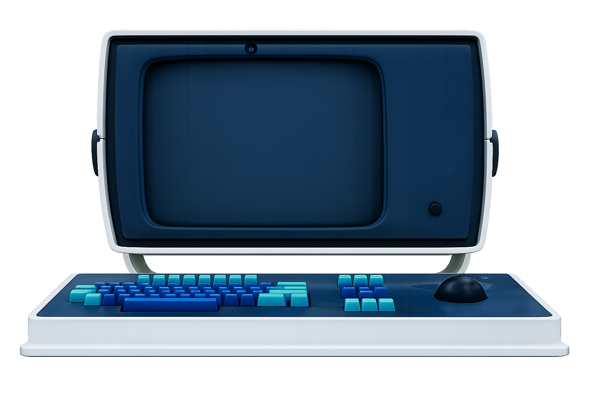

# Lumon Terminal Profile

A refined Apple Terminal profile for those who value clarity, discipline, and the quiet dignity of a well-ordered screen.

Inspired by the terminal environment of Lumon Industries as seen in *Severance*, this profile brings a calm blue workspace to macOS Terminal.

Please enjoy each command equally.



## Installation

### 1. Obtain the profile

[Download the profile](https://github.com/onehorizonai/lumon-terminal/raw/lumon.terminal) file directly from GitHub or clone this repository:

```bash

git clone https://github.com/onehorizonai/lumon-terminal.git lumon-terminal

cd lumon-terminal
```

### 2. Import the profile into Apple Terminal

1. Open Terminal
2. Go to Terminal > Settings
3. Select the Profiles tab
4. Click the ••• menu beneath the profiles list
5. Select Import….
6. Choose the downloaded `.terminal` file
7. Select the newly imported profile
8. Click Default if you wish to begin each session in alignment

### Bonus: install Ioskeley Mono Regular

For optimal visual harmony, install [Ioskeley Mono Regular](https://github.com/ahatem/IoskeleyMono).

Ioskeley Mono is a free and open-source Berkeley Mono-inspired font.

After installation:

1. Open Terminal > Settings > Profiles
2. Select the imported profile
3. Open the Text tab
4. Click Change… next to the font
5. Select Ioskeley Mono Regular
6. Recommended size: 12 or 13

## Sponsored by

> [!NOTE]
> Made possible by [One Horizon](https://onehorizon.ai), where roadmaps remain orderly, agents receive their work, and progress reports arrive without incident.

## Disclaimer

This project is not affiliated with, endorsed by, or connected to Apple TV+, “Severance,” or Lumon Industries (which is fictional).



## Acknowledgements

Gratitude is extended to:

* The visual world of Severance, for its disciplined approach to screens, silence, and corporate wellness.
* Ioskeley Mono, for providing a free and open-source Berkeley Mono-inspired typeface.
* The terminal customization community, for demonstrating that even small configuration files may serve a greater purpose.

## License

This project is licensed under the [MIT License](LICENSE).
